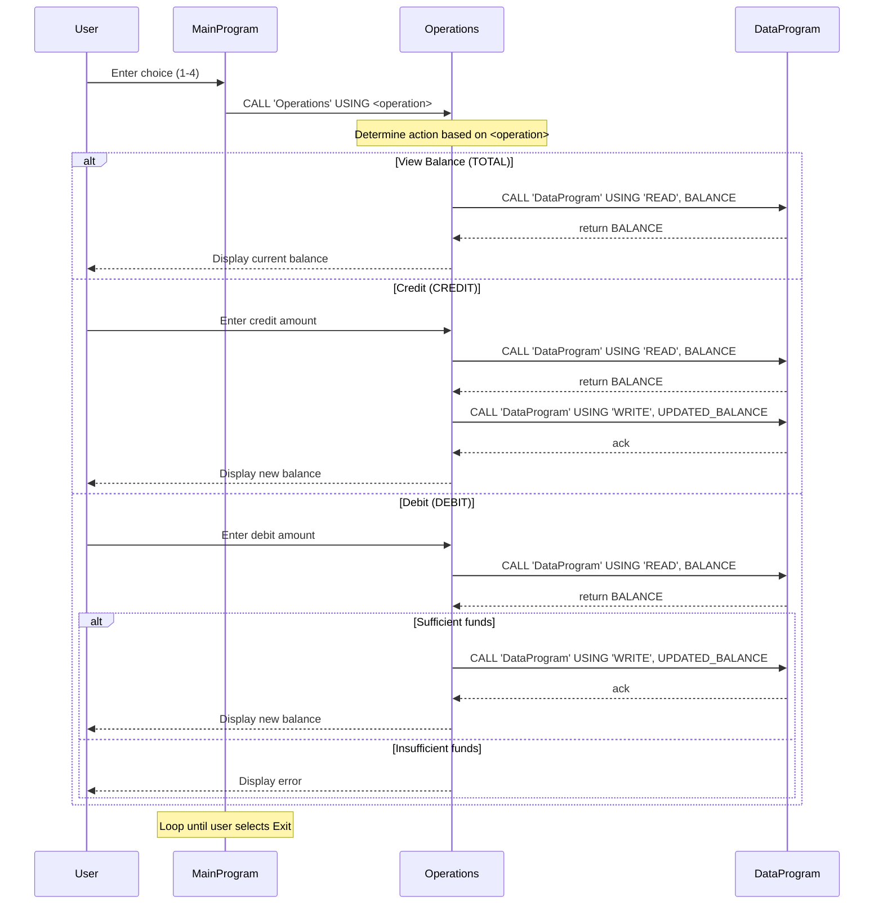

# Week 4 GHCP Training - COBOL Account Management

This repository contains a small COBOL-based account management system that simulates basic operations on a student account balance.

## 📄 Files Overview

### `src/cobol/main.cob`
- **Role:** Entry point for the application (Main program).
- **Responsibility:** Displays a text menu and accepts user input for actions.
- **Key behavior:**
  - Shows options for viewing balance, crediting, debiting, and exiting.
  - Calls the `Operations` program with a fixed operation token (`TOTAL`, `CREDIT`, `DEBIT`).
  - Keeps looping until the user selects "Exit".

### `src/cobol/operations.cob`
- **Role:** Central business logic controller for account operations.
- **Responsibility:** Interprets the action requested by `main.cob` and applies it to the account.
- **Key functions:**
  - **View Balance (`TOTAL`)**: Calls `DataProgram` to read the stored balance and displays it.
  - **Credit Account (`CREDIT`)**: Reads the amount from user input, reads the stored balance, adds the amount, writes the updated balance back.
  - **Debit Account (`DEBIT`)**: Reads the amount from user input, reads the stored balance, and only subtracts if there are sufficient funds.

### `src/cobol/data.cob`
- **Role:** Simulates persistent storage for the account balance.
- **Responsibility:** Maintains an in-memory balance (simulating a stored record) and manages read/write operations via a simple API.
- **Key behavior:**
  - Reads the current balance into a passed-in variable when called with `READ`.
  - Updates the stored balance when called with `WRITE`.
  - Initializes the stored balance to `1000.00`.

## 🧠 Business Rules (Student Accounts)

These rules govern how the account balance behaves in this system:

- **Initial Balance**: Every session starts with an initial balance of **1000.00**.
- **View Balance**: Selecting "View Balance" shows the current stored balance.
- **Credit Operation**:
  - The user enters an amount to deposit.
  - The entered amount is added to the current balance.
  - The updated balance is written back as the new stored balance.
- **Debit Operation**:
  - The user enters an amount to withdraw.
  - The system checks whether the current balance is greater than or equal to the requested debit amount.
  - If there are sufficient funds, the amount is subtracted and the updated balance is stored.
  - If there are insufficient funds, the system prints an error message and does not modify the stored balance.

## 🧩 Notes on Implementation

- The system uses COBOL `CALL` statements to separate concerns:
  - `main.cob` drives the menu and routes commands.
  - `operations.cob` holds business rules and validation logic.
  - `data.cob` holds the simulated persistent state.

- All numeric values use `PIC 9(6)V99`, allowing up to `999999.99`.

---

If you want to extend the system (e.g., support multiple accounts, file-backed persistence, or transaction history), the best place to start is by updating `data.cob` to persist state beyond a single run.

## 🧩 Sequence Diagram (Data Flow)

